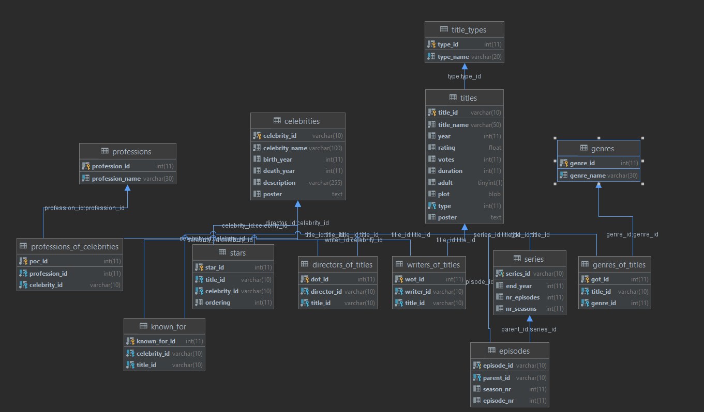
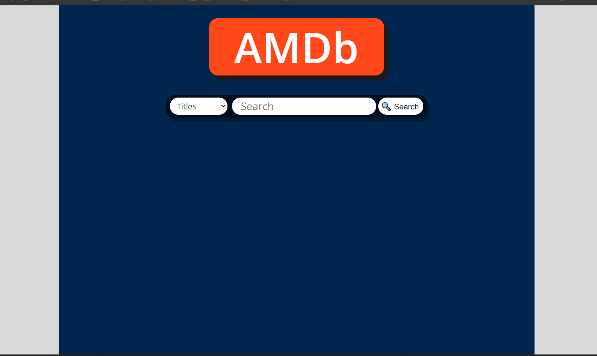

# Amateur Movie Database (AMDb)
An IMDb copycat website for searching information about films and actors.

## Description
This web application implements a user-friendly way of searching for movies, series, and celebrities’ information, just like the famous IMDb website. All the data is veridic and collected through use of python and java automated scripts that used .csv files provided for free by IMDb and also by making use of some free movie APIs.

The structure of the database looks like this:
 

## Usage
On the first page of the website, you are prompted to a search bar and you can select to search for titles or celebrities. You will be given as a result a set of 4 most popular matches of your searched words. If you click on them a page will be displayed where information about what you searched will be displayed.

## Contributing
I am open to contributions, if you want to add some cool features to this website, then feel free to make a pull request.

## License
This project is licensed under [MIT](https://choosealicense.com/licenses/mit/)
